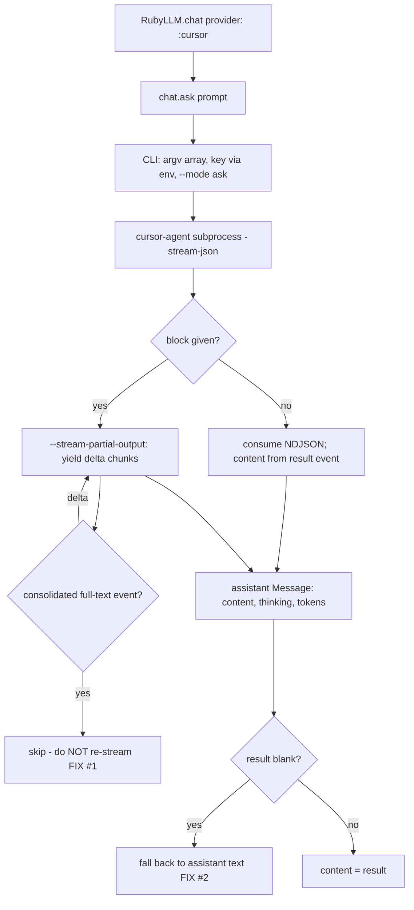
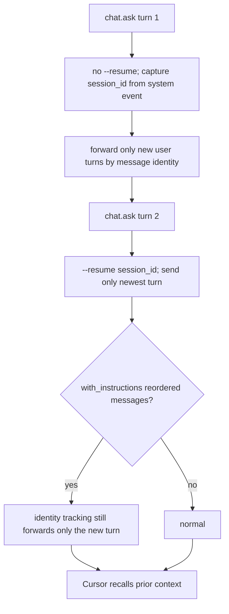
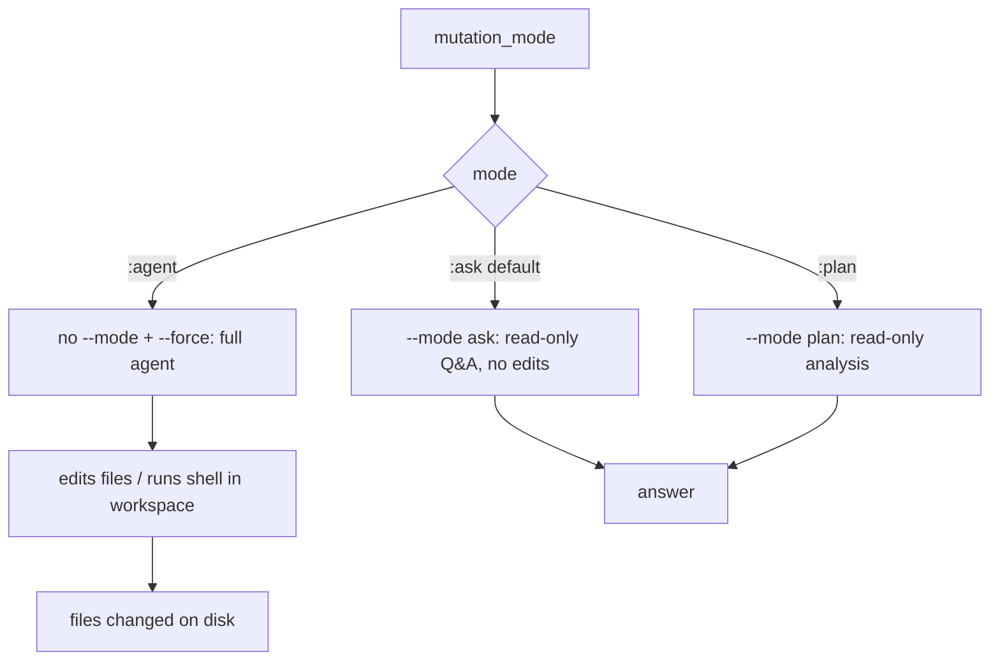
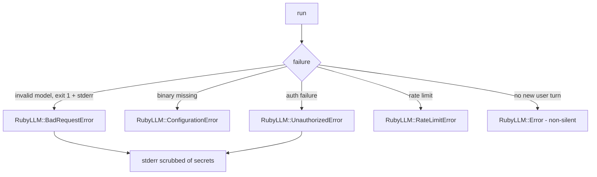

# Dogfood Report — `feat/cursor-provider`

**Date:** 2026-05-24
**Branch:** `feat/cursor-provider` vs `main`
**Mode:** API-level dogfood (headless Ruby gem — no web UI; `ce-dogfood-beta`'s browser mechanism does not apply, so flows were exercised through the public Ruby API against the real `cursor-agent` CLI).
**Verdict:** ✅ **Ready.** Every flow verified live against `cursor-agent 2026.05.20`; unit suite (46 examples) + RuboCop green locally and on CI across Ruby 3.1–3.4. Two bugs found and fixed during dogfooding.

---

## 1. Diff Summary

`main` contains only the implementation plan. `feat/cursor-provider` adds the entire gem:

- `lib/ruby_llm/cursor/{provider,cli,event_mapper,errors,version}.rb` + entrypoints — registers a `:cursor` provider that drives `cursor-agent` over a subprocess.
- `spec/` — 46 unit examples (subprocess stubbed with real-captured NDJSON fixtures) + opt-in live smoke test.
- Packaging: gemspec, Gemfile, Rakefile, RuboCop, MIT license, README, GitHub Actions CI.

User-visible surface (developer-facing API): `RubyLLM.chat(provider: :cursor)` → `ask` (sync), `ask {…}` (streaming), multi-turn via persistent session, `with_params(cursor: { on_event:, mutation_mode:, workspace: })`, and `RubyLLM.configure` options (`cursor_api_key`, `cursor_agent_path`, `cursor_default_cwd`, `cursor_default_model`, `cursor_mutation_mode`).

---

## 2. Personas

No `STRATEGY.md`/`VISION.md`/persona docs exist; persona **inferred** from the gem and diff:

- **P1 — RubyLLM Ruby developer.** Already uses RubyLLM across providers; wants codebase-aware Q&A and to drive Cursor's agent from Ruby. Cares that `:cursor` behaves like every other provider (same `Message`, streaming, errors) and that a "chat" call does **not** silently mutate the filesystem.

---

## 3. Flows Tested

### Flow A — Ask (sync) and Streaming

### Flow B — Multi-turn (one Chat ↔ one Cursor session)

### Flow C — Mutation posture (R12) and agent edits

### Flow D — Error paths

---

## 4. Test Matrix & Results

All "live" rows were executed against the real `cursor-agent`. "unit" rows are covered by the green spec suite.

| ID | Scenario | Type | Result | Notes |
|----|----------|------|--------|-------|
| S-ASK | `ask` returns assistant text + token usage | live | ✅ Pass | `"pong"`, real tokens (in≈33k, cached≈4.8k) |
| S-KEY | Key injected via `config.cursor_api_key` only (ambient env removed) | live | ✅ Pass | proved gem injects key; `"API KEY WORKS"` returned |
| S-STREAM | Streaming yields incremental text, no duplication | live | ✅ Pass (after Fix #1) | deltas only; consolidated event not re-streamed |
| S-MULTI | Multi-turn resume recalls context | live | ✅ Pass | stable `session_id`; recalled `42` |
| S-BLANK | Empty `result` falls back to assistant text | unit + live | ✅ Pass (after Fix #2) | blank-aware fallback |
| S-PLAN | `:plan` mode answers and writes no files | live | ✅ Pass | read-only confirmed (dir unchanged) |
| S-EVENTS | `on_event` observes raw events; `tool_calls` empty | live | ✅ Pass | saw system/user/thinking/assistant/result |
| S-AGENT | `:agent` mode edits files in workspace | live | ✅ Pass | created `hello.txt` = `hi` in temp sandbox |
| S-ERR-MODEL | Invalid model → typed error | live | ✅ Pass | `RubyLLM::BadRequestError` |
| S-ERR-BIN | Missing binary → ConfigurationError | live | ✅ Pass | bogus `cursor_agent_path` |
| S-NOTURN | No new user turn → raises | live | ✅ Pass | non-silent `RubyLLM::Error` |
| S-RESOLVE | Arbitrary model id resolves w/o models.json | unit | ✅ Pass | `assume_models_exist?` |
| S-CONN | Chat constructs with no HTTP socket | unit | ✅ Pass | `connection` nil; no Faraday |
| S-INJECT | Malicious prompt stays one argv element | unit | ✅ Pass | argv array, no shell string |
| S-SECRET | Key never in argv; stderr scrubbed | unit | ✅ Pass | key via env only |

---

## 5. What Was Fixed (during dogfooding)

### Fix #1 — Streaming output doubled
- **Symptom:** live streaming produced `"Red, Yellow, BlueRed, Yellow, Blue"`.
- **Root cause:** with `--stream-partial-output` the CLI emits incremental delta events **and** a consolidated full-text event per block; the provider streamed both.
- **Fix:** `EventMapper` distinguishes deltas (`timestamp_ms`, no `model_call_id`) from consolidated events; only deltas are streamed.
- **Regression test:** `streaming_deltas.ndjson` fixture now ends with the consolidated event; `provider_spec` asserts the streamed text is not doubled.
- **Commit:** `fix: streaming delta de-dup and blank-result fallback`

### Fix #2 — Empty `result` returned `nil` content
- **Symptom:** some live turns returned `nil` content despite the agent producing text.
- **Root cause:** `result_text || last_full || delta_text` — but `""` is truthy in Ruby, so an empty `result` shadowed the assistant-text fallback.
- **Fix:** blank-aware `first_present` helper (result → last full assistant message → deltas).
- **Regression test:** `provider_spec` "uses the assistant message when cursor-agent returns an empty result".
- **Commit:** same as Fix #1.

Both fixes were surfaced only by live end-to-end runs — the stubbed fixtures had modeled an idealized event stream the real CLI does not produce.

---

## 6. Paper Cuts (by persona)

| Paper cut | Persona | Severity | Status |
|-----------|---------|----------|--------|
| `cursor-agent` is nondeterministic on trivial prompts — `result` occasionally empty or rambly; content may come back `nil` or include filler | P1 | Low–Med | Mitigated (blank-result fallback); inherent to the agent. Documented in README limitations. |
| Streaming includes the agent's exploratory preamble (e.g. "Checking whether the workspace defines primary colors…") that the final `content` (from `result`) omits — stream ≠ final content | P1 | Low | Documented; expected for an agent. Deferred. |
| Event callback uses `with_params(cursor: { on_event: })`, not RubyLLM's idiomatic `on_tool_call` — a dev may look for the latter first | P1 | Low | Intentional (Cursor events are observational, must not trigger the tool loop). Documented; deferred. |
| Token counts are large (~33k input) for tiny prompts because Cursor bundles system/repo context; RubyLLM cost is not computed | P1 | Low | Documented in README. Deferred. |

---

## 7. Decisions for a Human

None block readiness. Open product/positioning calls (intentionally not auto-decided):

1. **`with_fallback` unsupported with `:cursor`.** Agent session state lives on the per-Chat provider instance, which fallback re-resolution replaces. Options: (a) document + leave unsupported (current); (b) move session state off the provider instance keyed on the Chat (larger refactor). Recommendation: keep (a) for v1, revisit if demand appears.
2. **Repo visibility + merge.** Repo is currently **private**; PR #1 is green and unmerged. Recommendation: your call to merge / make public.
3. **Plan doc R5 wording.** The plan asserted "concatenated stream text equals final content," which dogfooding disproved (stream carries preamble; content = `result`). Recommendation: amend R5 in the plan for accuracy (doc-only).

---

## 8. Learnings

- **Stub fixtures must be captured from the real tool, including its "ugly" events.** Both bugs lived in the gap between an idealized event stream and reality (consolidated repeats; empty `result`). A spike that records *real* output before writing fixtures is worth the credits.
- **`""` is truthy in Ruby** — `a || b` fallbacks silently break on empty strings; prefer a blank-aware selector for "first meaningful value."
- **Agent-as-provider needs a safety default.** `--mode ask` read-only by default with explicit opt-in to edits (`:agent` + `--force`) keeps a "chat" call from surprising filesystem mutations — verified both directions live.
- Candidates worth feeding to `ce-compound`: the fixture-from-reality learning and the truthy-empty-string fallback.

---

## 9. Final Status

✅ **Ready to merge.** All 15 matrix scenarios pass (11 verified live, including real file edits in `:agent` mode); 46 unit examples + RuboCop green on CI across Ruby 3.1–3.4. No blocking issues. Outstanding items are product decisions (fallback support, visibility/merge) and one doc-accuracy tweak — none gate the branch.
